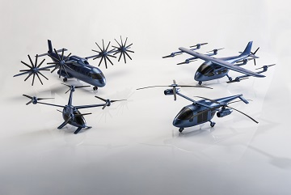

<h1>NPSS Power System Library Documentation</h1>

## Background
Electrified aircraft propulsion (EAP) is a prospective advanced propulsion concept to reduce aircraft noise, NOx emissions and aircraft fuel burn. In its most primitive definition, EAP refers to concepts that utilize electrical power in propulsion of the aircraft. This includes hybrid electric, such as the Boeing-General Electric (GE) “Sugar Volt” and turboelectric concepts, such as STARC-ABL, featuring two main engines and an electrically powered aft thruster for boundary layer ingestion. It also includes electric vertical takeoff and landing (eVTOL) vehicles such as NASA's revolutionary vertical lift technologies (RVLT) concepts. The images below show renderings of the Sugar Volt, STARC-ABL, and RVLT EAP concept vehicles.

**Renderings of electrified propulsion concept vehicles**

Hybrid electric and turboelectric concepts utilize an electrical power system to deliver power from an electrical source, e.g. battery or generator, to a motor which drives a propulsor (or aids a turbine) that provides thrust for the vehicle. The electrical power system impacts the overall weight, thermal system requirements, and efficiency of the propulsion system and these tradeoffs need to be considered to meet the design objectives, especially in an optimized fashion. More specifically, this requires the power system to be included in the conceptual design phase of the propulsion system. One of the most widely used tools for conceptual design of propulsion systems is the Numerical Propulsion System Simulation (NPSS).

This repository, the NPSS Power System Library (PSL), is designed to enable NPSS to address these needs for modeling EAP systems. Further, this documentation describes the library, how to use it, and the components, tools, and other files that it contains.

## NPSS Power System Library
This library contains a set of power system and circuit components, as well as an interpreted electric port, designed to connect power system components together. The electric port included in this library passes voltage, current, and electrical power information back and forth using complex numbers (phasors), implemented via a complex number class. The components are designed to work in a manner similar to baseline NPSS components like compressors, turbines, ducts, and others. Electric machine components, being the motors and generators, have performance (efficiency) maps that work in a similar way to the ones in NPSS compressors and turbines.

The library also contains simplified thermal management system (TMS) components designed to be connected to the library's power system blocks. These are similar to base NPSS components that can be used to represent TMSes, such as ducts and heat exchangers, but are set up to be convenient to integrate with power blocks.

## Solver Setup for Power System Blocks
--describe what we do with the solver, especially voltage independents in the node element and other elements (which have internal nodes), also describe the on-design current independents

## Solver Sequence for Power System Blocks and Their Use of "PrePass()"
--describe the prePass shit we do, and the need for cable/breaker blocks to execute before the other blocks (with internal nodes)

## Power Blocks in Assemblies
--describe things people need to know about how to use power blocks in assemblies, depends on

## Connecting Power Components
--describe linkPortsI

## Electric Power Types
--describe the electric power types, and how they affect the solver setup. Describe the power propagation logic once it is completed

To continue reading, see [Items Within Library](Items-Within-Library).
